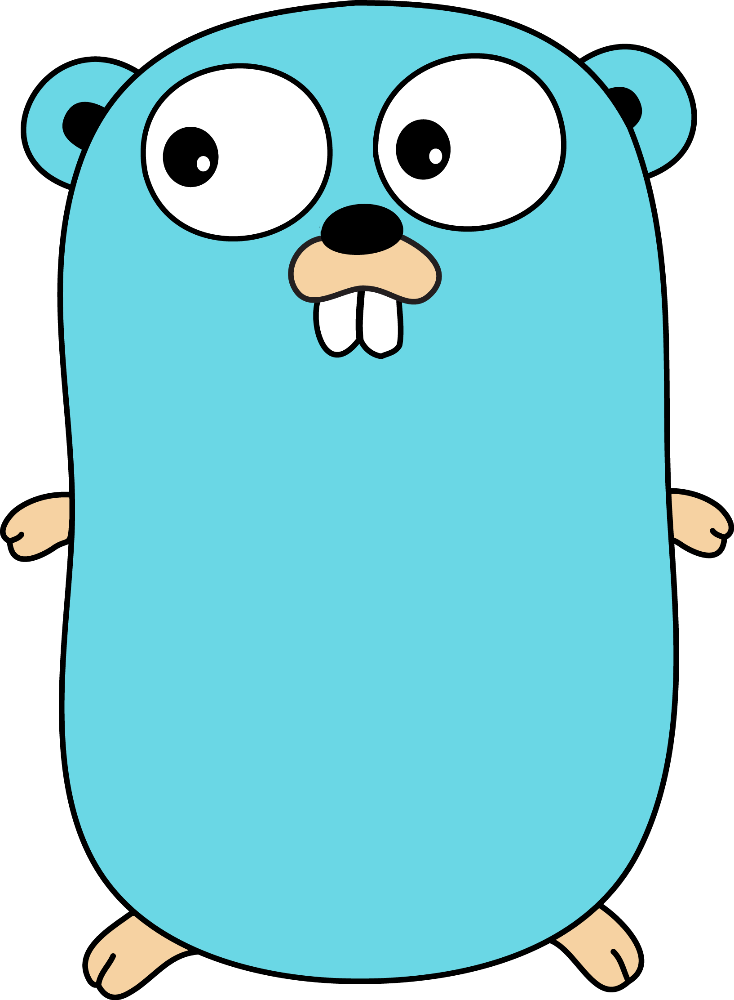

  

  

  I'm a Computer Engineering student at the Federal University of Santa Maria.
  I'm interested in Artificial Intelligence applications, ranging from Machine Learning
  to Retrieval-Augmented Generation (RAG), as well as high-performance distributed systems.
  My main area of expertise is backend development, and Go is my primary programming language.

 

  
  > **Long live the Gopher!** 

 

## 🛠 Technologies & Tools

  

## 🌐 Social Media

  
  

 

## 🐍 GitHub Status

  
  

  <picture>
    <source media="(prefers-color-scheme: dark)" srcset="https://raw.githubusercontent.com/LucasM4r/LucasM4r/output/github-contribution-grid-snake-dark.svg">
    <source media="(prefers-color-scheme: light)" srcset="https://raw.githubusercontent.com/LucasM4r/LucasM4r/output/github-contribution-grid-snake.svg">
    
  </picture>

---

